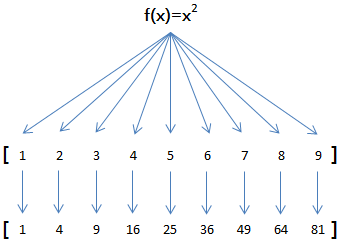

# 1.1 map方法

>  map(function,iterable)函数接收两个参数，一个是函数，一个是可迭代对象，map将传入的函数依次作用到序列的每个元素，并把结果作为新的list返回。 

比如我们有一个函数f(x)=x2，要把这个函数作用在一个list [1, 2, 3, 4, 5, 6, 7, 8, 9]上，就可以用map()实现如下：   


我们用python代码实现：

```python
def func(x):
    return x**2

list(map(func,range(1,10))) #python3会返回map对象，python2会直接返回列表
```

下面 我们处理一个任务：

将[1,2,3,4,5,6,7,8] 处理成['1', '2', '3', '4', '5', '6', '7', '8']

```python
list(map(str,[1,2,3,4,5,6,7,8]))
```

> 当可迭代对象多一个时，可以并行地对每个可迭代对象执行map

```python
list1 = map(lambda x,y:x**y,[1,2,3],[4,4,4])
list(list1)
list2 = map(lambda x,y:(x**y,x+y),[1,2,3],[1,2,3])
list(list2)
```

